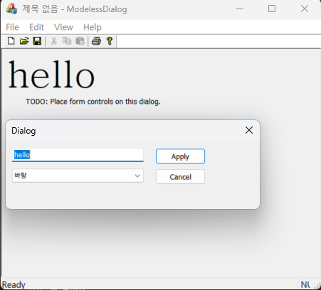



### 코드 목적
비모드형 대화 상자 활용하기

### 주요 코드
- 객체를 멤버 변수로 선언해 참조한다.
- `CModelessDialogView::OnLButtonDown()` : 대화 상자 객체를 생성하고 값을 넘겨준다.
- `CMyDialog::OnBnClickedApply()` : `UpdateData(TRUE)`를 이용해 DDX를 직접 동작시킨다.
- `CMyDialog::OnCancel()` : `CDialog::OnCancel()`을 호출하지 않고 `DestroyWindow()`를 이용해 대화 상자를 파괴한다.
- `CMyDialog::PostNcDestroy()` : 대화상자 객체에서 대화 상자 객체 스스로를 파괴한다.
