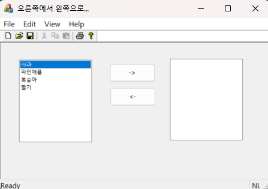



### 코드 목적
리스트 박스 컨트롤 활용하기

### 주요 코드
- [View 바로가기](https://github.com/ChoYoungwon/Windows-Programming/blob/main/05_MFC_Standard_Controls/05_ListBox/05_ListBoxView.cpp)
- `CMy05ListBoxView::OnBnClickedRight()` : -> 화살표 클릭시 이벤트 핸들러
- `CMy05ListBoxView::OnBnClickedLeft()` : <- 화살표 클릭시 이벤트 핸들러