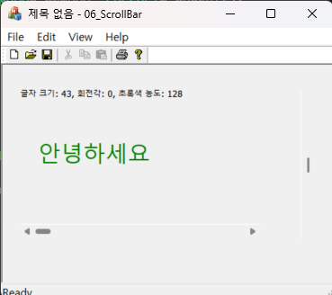



### 코드 목적
스크롤바 컨트롤 활용하기

### 주요 코드
- `CMy06ScrollBarView::OnHscroll()` : `WM_HSCROLL` 메시지 처리, `SB_THUMBTRACK` 처리
- `CMy06ScrollBarView::OnVSCroll()` : `WM_VSCROLL` 메시지 처리, `SB_THUMBTRACK`, `SB_LINEUP`, `SB_LINEDOWN`, `SB_PAGEUP`, `SB_PAGEDOWN` 처리
- `OnDraw()` : 가상함수 추가(재정의), 현재 상태를 출력(폰트 크기, 회전각, 색상)