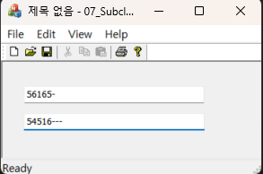



### 코드 목적
컨트롤 서브클래싱 구현

### 주요 코드
- CEdit을 상속하는 CMyEdit 클래스를 추가
- ``CMyEdit::Onchar()`` : `WM_CHAR` 메시지 핸들러, 숫자, 하이픈, backspace만 입력되게 설정
- ``CMyEdit m_edit2``로 변수 생성 후 `m_edit2.SubclassDlgItem(IDC_EDIT2, this)` 서브클래싱 코드를 추가함