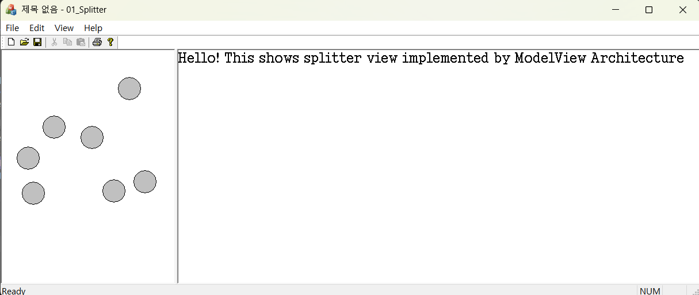



### 코드 목적
정적 분할 윈도우 구현하기

### 주요 코드
- `CMy01SplitterView::OnDraw()` : 원 출력
- `CKeyInputView::OnDraw()` : 글자 출력
- `CKeyInputView::OnChar()` : 키보드 이벤트 탐지, 해당 글자 동적 배열에 추가
- `CMainFrame::OnCreateClient()` : 정적 분할 윈도우 생성