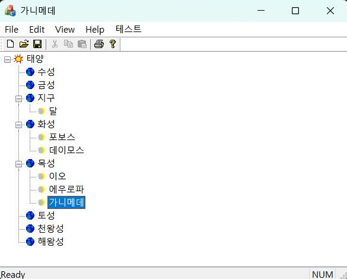



### 코드 목적
트리 뷰 활용하기

### 주요 코드
- view의 `OnInitialUpdate` 부분 : 트리 컨트롤 초기화
- view의 `PreCreateWindow` : 네 개의 트리 컨트롤 스타일을 추가
- View의 `OnTestDeleteselected` : 메뉴 항목에 대한 명령 핸들러 (선택된 항목 삭제)
- view의 `OnTvnSelchanged` : 항목 선택이 변경될 때마다 윈도우 타이틀바에 추가