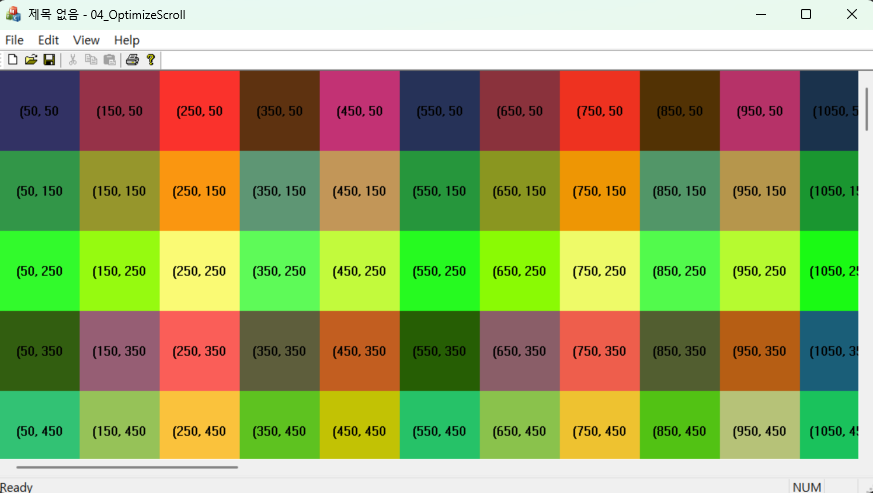



### 코드 목적
스크롤 뷰 활용

### 주요 코드
- 뷰의 `OnSize()` : 크기 변경기 동작하는 메시지 핸들러, 메시지를 받을 때마다 페이지 크기를 변경
- 뷰의 `MyDraw()` : 정사각형 그리기(한 변의 길이가 100픽셀인 정사각형을 그린다.)
- 뷰의 `OnDraw()` : 정사각형 여러 개를 출력
- `OnEraseBkgnd()` : 깜빡임 문제 해결(디폴트 브러시로 클라이언트 영역이 칠해지는 것을 막을 수 있다.)