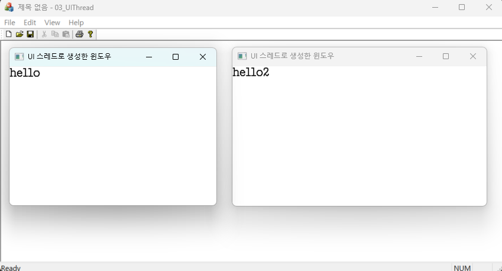



### 코드 목적
UI 스레드 구현

### 주요 코드
- `CMyWnd 클래스`의 `OnChar`, `OnPaint` 메시지 핸들러 : 키보드 입력을 받아서 화면에 출력함
- `CMyThread::InitInstance()` : 프레임 윈도우 객체를 생성
- `CMy03UIThreadView::OnLButtonDblClk` : 좌클릭시 UI 스레드를 생성한다.