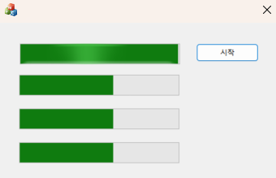



### 코드 목적
이벤트 활용하기

### 주요 코드
- `CMy06EventDlg::OnBnClickedStart()` : 스레드 생성(4개)
- `InitThread(LPVOID pParam)` : 가장 먼저 실행되는 스레드
- `WorkThread(LPVOID pParam)` : 이벤트 신호 상태가 될 때까지 대기하다 InitThread가 신호 상태로 바꿀시 실행된다.