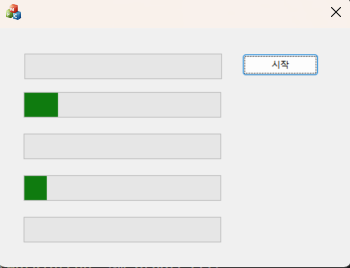



### 코드 목적
세마포어 활용

### 주요 코드
- `CMy07SemaphoreDlg::OnBnClickedStart()` : 스레드 5개 생성
- `WorkThread(LPVOID pParam)` : 임의 시간이 지난 후 프로그레스 컨트롤을 증가 시키도록 한다.
- `CSemaphore g_sem(2, 2)` : 카운트 초기값은 2, 카운트 최댓값은 2이다.