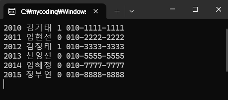



### 코드 목적
ODBC 사용하기(코드)

### 주요 코드
main()의 else부분  
1) 데이터베이스 객체 생성(`CDatabase::OpenEx()`)  
2) 레코드셋 객체 생성(`CRecordset rs(&db)`) -> 열기(`rs.Open(CRecordset::dynaset, _T("SELECT * FROM 테이블1"));`)  
3) 데이터 출력(`rs.GetFieldValue(short(0), str)`, `rs.MoveNext()`)  
4) 종료 처리(`rs.Close(); db.Close();`)  