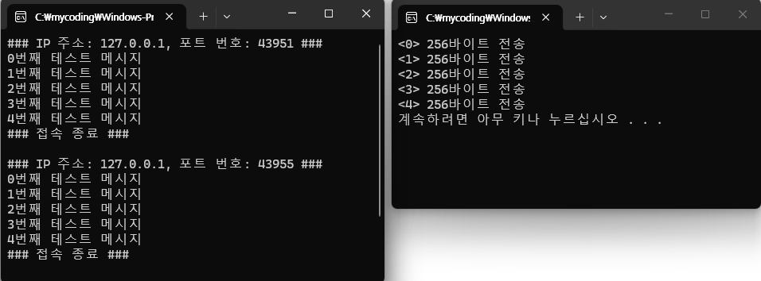



### 코드 목적
TCP Client(콘솔)

### 주요 코드
- `ErrQuit(int err)` : 오류 문자열 화면 출력
- `main 부분`
	- `if (!sock.Connect(_T("127.0.0.1"), 8000))` : 서버에 접속한다.
	- `nbytes = sock.Send(buf, 256);` : 서버에 데이터를 보낸다.
	- `sock.Close();` : 소켓을 닫는다.