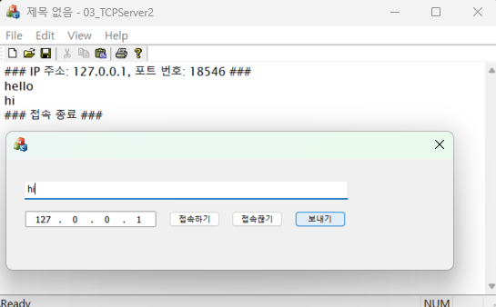



### 코드 목적
TCP Client (GUI)

### 주요 코드
- dlg.cpp
- `OnBnClickedConnect()` : 접속하기 버튼을 눌렀을때의 동작, 서버에 접속한다.(Connect())
- `OnBnClickedDisconnect()` : 접속끊기 버튼을 눌렀을때의 동작, 서버 접속을 끊는다. (Close())
- `OnBnClickedSend()` : 보내기 버튼을 눌렀을때의 동작, 서버에 데이터를 보낸다.
  
- CDataSocket.cpp